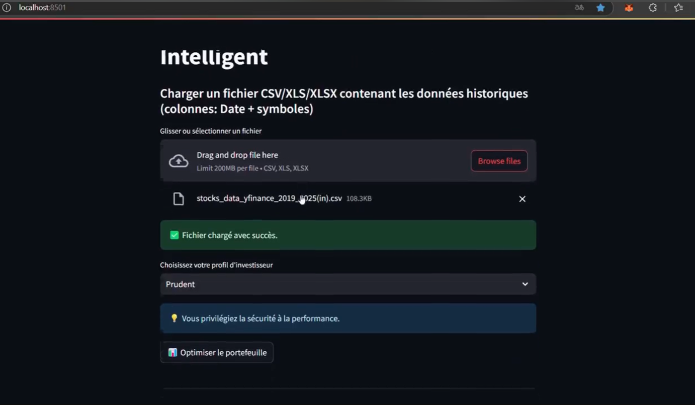
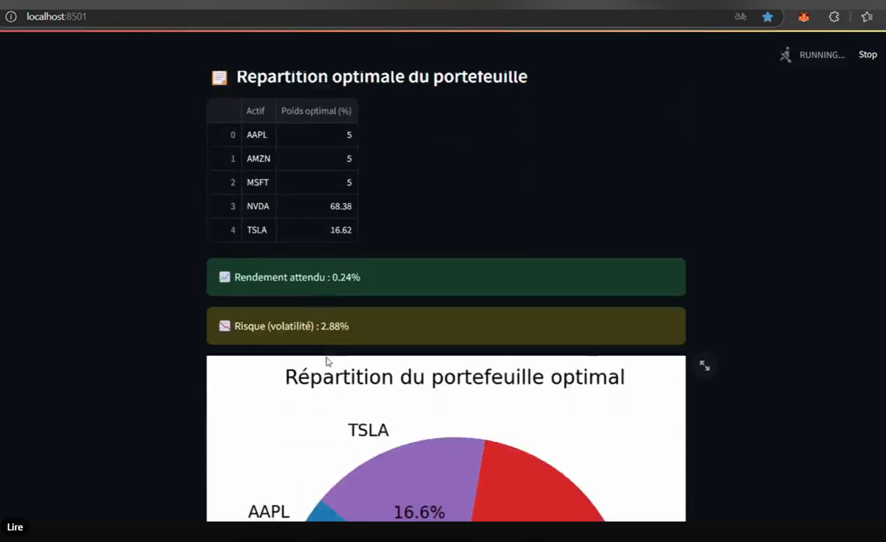
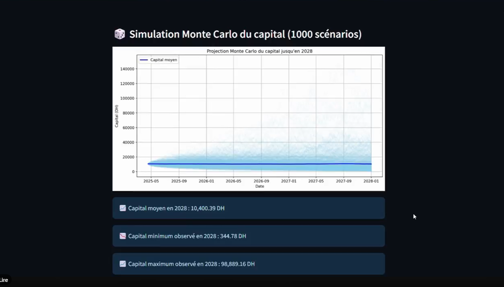

# 📊 Optimiseur de Portefeuille Intelligent

Un simulateur interactif développé avec **Streamlit** permettant d’optimiser un portefeuille financier, de projeter le capital et de réaliser des simulations Monte Carlo.

---

## 🚀 Fonctionnalités

- **Importation de données financières**  
  Charger des fichiers CSV ou Excel contenant les prix historiques des actifs (colonnes : `Date` + symboles d’actifs).

- **Optimisation de portefeuille**  
  Utilisation de la bibliothèque [cvxpy](https://www.cvxpy.org/) pour calculer les poids optimaux selon le profil de l’investisseur :  
  - Prudent  
  - Modéré  
  - Dynamique  

- **Analyse des performances**  
  Obtenir pour le portefeuille optimisé :  
  - Poids optimaux des actifs  
  - Rendement attendu  
  - Risque (volatilité)

- **Visualisations interactives**  
  - Répartition du portefeuille (camembert)  
  - Rendement cumulé du portefeuille  
  - Projection du capital jusqu’en 2028  
  - Simulation Monte Carlo avec intervalle de confiance (1000 scénarios)

- **Exportation des résultats**  
  Exporter la répartition optimale et les résultats en fichier Excel.

---
## Demo

